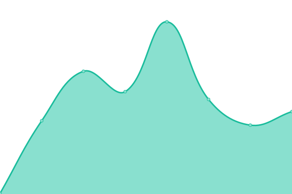
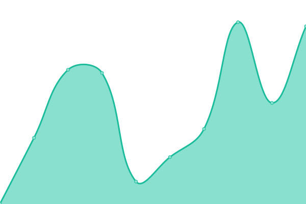

# [📈 Live Status](https://status.xyqra.com): <!--live status--> **🟩 All systems operational**

This repository contains the open-source uptime monitor and status page for [Xyqra](https://xyqra.com), powered by [Upptime](https://github.com/upptime/upptime).

With [Upptime](https://upptime.js.org), you can get your own unlimited and free uptime monitor and status page, powered entirely by a GitHub repository. We use [Issues](https://github.com/Xyqra/uptime/issues) as incident reports, [Actions](https://github.com/Xyqra/uptime/actions) as uptime monitors, and [Pages](https://status.xyqra.com) for the status page.

<!--start: status pages-->
<!-- This summary is generated by Upptime (https://github.com/upptime/upptime) -->
<!-- Do not edit this manually, your changes will be overwritten -->
<!-- prettier-ignore -->
| URL | Status | History | Response Time | Uptime |
| --- | ------ | ------- | ------------- | ------ |
|  Rustlog | 🟩 Up | [rustlog.yml](https://github.com/Xyqra/uptime/commits/HEAD/history/rustlog.yml) | 

 224ms
     
 | 

<a href="https://status.xyqra.com/history/rustlog">100.00%</a>
    

|  Shortener | 🟩 Up | [shortener.yml](https://github.com/Xyqra/uptime/commits/HEAD/history/shortener.yml) | 

 310ms
     
 | 

<a href="https://status.xyqra.com/history/shortener">100.00%</a>
    

|  API | 🟩 Up | [api.yml](https://github.com/Xyqra/uptime/commits/HEAD/history/api.yml) | 

 345ms
     
 | 

<a href="https://status.xyqra.com/history/api">100.00%</a>
    

|  [Status](https://status.xyqra.com) | 🟩 Up | [status.yml](https://github.com/Xyqra/uptime/commits/HEAD/history/status.yml) | 

 219ms
     
 | 

<a href="https://status.xyqra.com/history/status">100.00%</a>
    

|  [Catbox (not mine)](https://catbox.moe) | 🟩 Up | [catbox-not-mine.yml](https://github.com/Xyqra/uptime/commits/HEAD/history/catbox-not-mine.yml) | 

 1506ms
     
 | 

<a href="https://status.xyqra.com/history/catbox-not-mine">100.00%</a>
    

<!--end: status pages-->

[**Visit our status website →**](https://status.xyqra.com)

## 📄 License

- Powered by: [Upptime](https://github.com/upptime/upptime)
- Code: [MIT](./LICENSE) © [Anand Chowdhary](https://anandchowdhary.com), supported by [Pabio](https://pabio.com)
- Data in the `./history` directory: [Open Database License](https://opendatacommons.org/licenses/odbl/1-0/)
